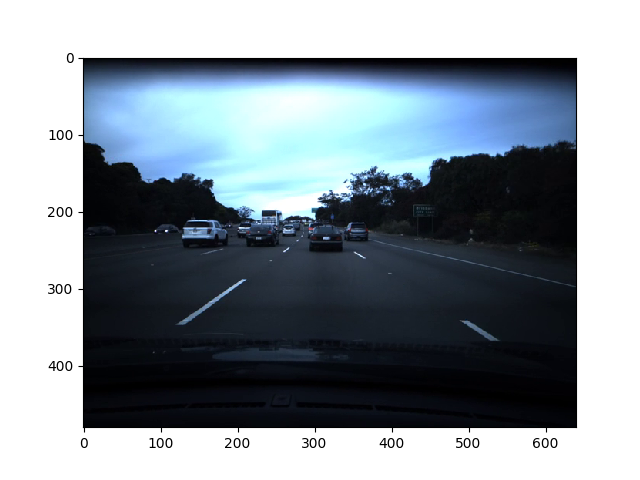
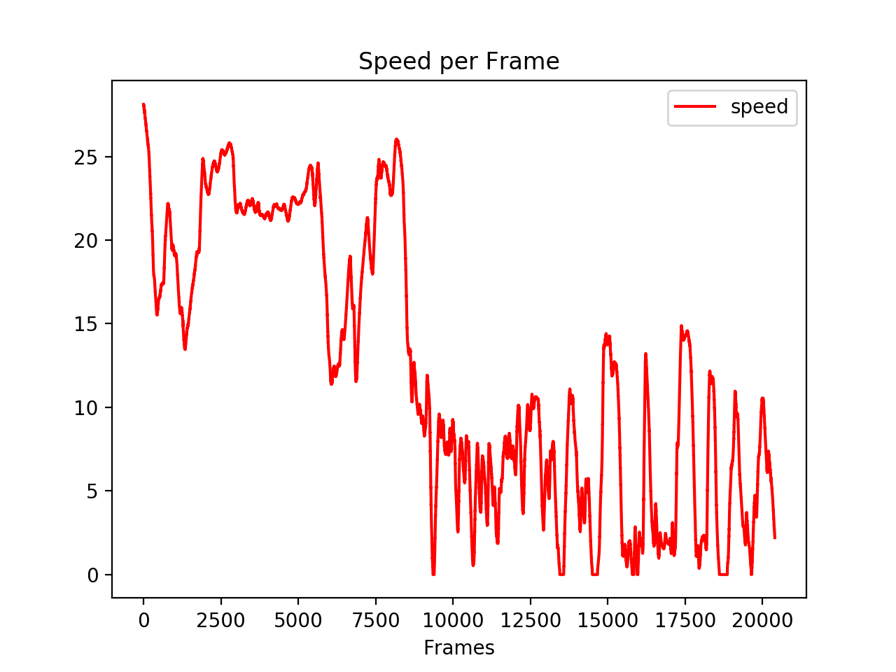
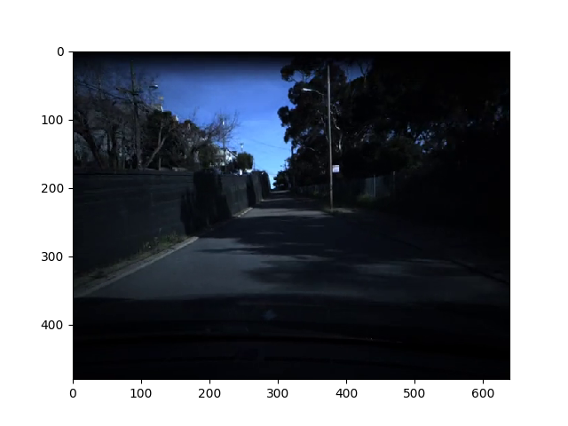
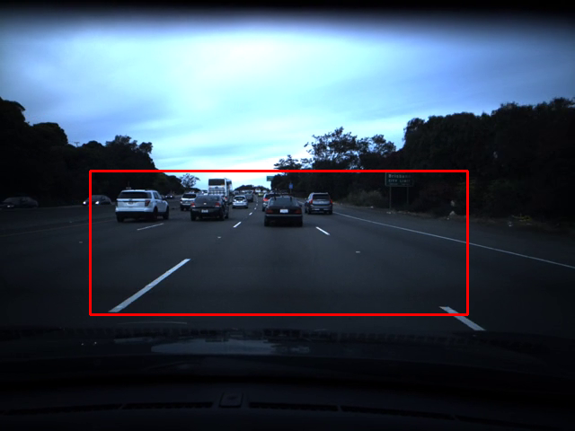
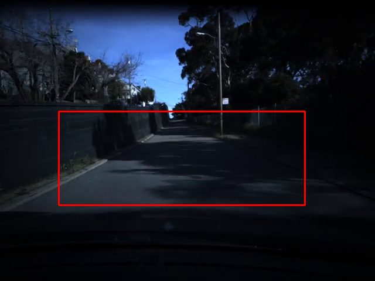
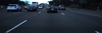
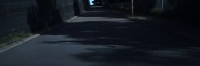
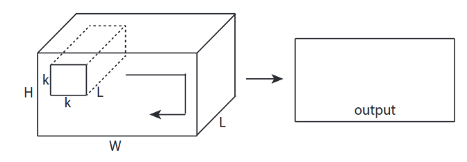
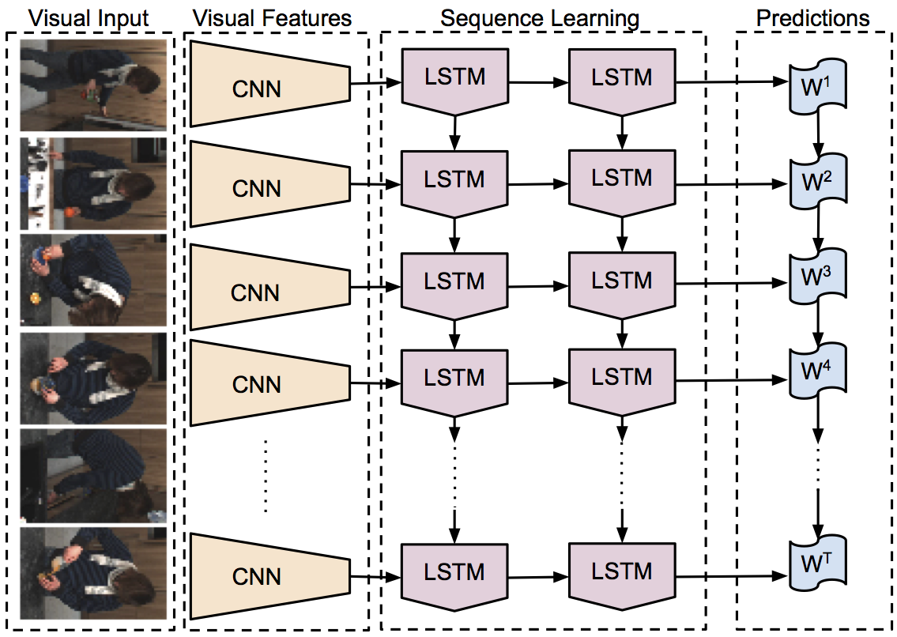

# Learning To Predict Vehicle Speed From A Video



**This is a project report for the comma.ai programming challenge.**

Basically, the goal is to predict the speed of a car from a video.


## Comma.ai Programming Challenge

This project is for Comma.ai programming challenge. The instruction is as follows:

```
Welcome to the comma.ai 2017 Programming Challenge!

Basically, your goal is to predict the speed of a car from a video.

data/train.mp4 is a video of driving containing 20400 frames. Video is shot at 20 fps.
data/train.txt contains the speed of the car at each frame, one speed on each line.

data/test.mp4 is a different driving video containing 10798 frames.
Video is shot at 20 fps.
Your deliverable is test.txt

We will evaluate your test.txt using mean squared error.
<10 is good. <5 is better. <3 is heart.
```

When I first read the specification, the problem seemed simple enough that it would not require a complex model.
I mean, regressing the edges of each frames should roughly give the speed.
But I want this project to be ultimately useful for self-driving.
And since I was studying the deep learning approaches in natural language processing,
I wanted to use this opportunity to learn more about image/video processing using deep learning.

## Dataset Exploration

In order to predict the speed, I will have to feed multiple images to the model.
How many frames do I need? The video is shot at `20 fps`.
If the frame was taken more granularly, I will have to skip frames in every few frames to give the fast-forward effect. But here I can use the frames as-is.
So that means 10 frames is about half a second. This should be enough.

Now let's look at the dataset.

### Train Dataset

The training dataset is about 17 minutes in total, which contains 20400 frames.
Two types of scenes seem to appear:

* **0:00 - 12:30**: highway (12 min 30 sec)
* **12:31 - 17:00**: street (4 min 30 sec)



The labels (speed), accordingly, have less-diverse and higher speeds in the highway in the first half and more diverse and slower speeds in the street.


### Test Dataset

Test data is total of 9 minutes. It has three types of scenes:

* **0:00 - 1:30**: street but the ones that do not appear on the training data (1 min 30 sec)
* **1:30 - 4:30**: highway (3 min)
* **4:30 - 9:00**: street that is similar to the one that appears in the training data. (4 min 30 sec)

The test dataset definitely has more varied scenes including the ones that do not appear in the training dataset. For example, some do not have clear lanes. We'll have to be careful not to over-fit to the training dataset.




## Preprocessing


### Sliding Window

A dataset with 20400 frames is a small one to train on. So I want to use every possible samples.
I used split ratio of 90%. So out of 20400 frames, 90% (18360 Frames) are used for training and 10% (2040 Frames) are used for the validation.

I used sliding window with different shifting values to create several variations of datasets. They have same number of samples but those samples are slightly shifted in time. This was because I had ensemble approach in mind. I wanted to feed models slightly different dataset to produce varying opinions. Averaging them might give a better prediction.

### Cropping & Resizing

First I cropped out the unnecessary parts.
The car and sky do not give much information about speed.
So it would be reasonable to crop them out.

 Scene 1                   |  Scene 2                  |  Scene 3
:-------------------------:|:-------------------------:|:-------------------------:
    |    | 


Next, I resized the image smaller for training. My computer gets sad when given a large image.
The resized image has 200 pixel width and 66 pixel height.

 Scene 1                   |  Scene 2                  |  Scene 3
:-------------------------:|:-------------------------:|:-------------------------:
  |  | 


Lastly, the resized image is normalized to the range of [0, 1].


### Data Augmentation

As stated above, 20400 frames is not enough to derive the best performance of the model.
To make it better, data augmentation is needed to maximize the number of examples.
I used dropout, noise, brightness changes and etc to simulate the real-life-like noise effects.
Thankfully, `imgaug` package made it really easy.
Simple block of code below takes care of the work.

```python
sometimes = lambda aug: iaa.Sometimes(0.5, aug)
aug = iaa.SomeOf(1,[
        sometimes(iaa.OneOf([
            iaa.Dropout((0.01, 0.1)),
            iaa.CoarseDropout((0.03, 0.07),
                              size_percent=(0.03, 0.15)),
        ])),
        sometimes(iaa.DirectedEdgeDetect(0.4)),
        sometimes(iaa.AdditiveGaussianNoise(loc=0,
                                            scale=(0.3, 0.7))),
        sometimes(iaa.Sharpen(alpha=(0, 1.0), lightness=(0.75, 1.5))),
        sometimes(iaa.Add((-7, 7)))])
```

## Models

I played with two models in this project. One uses 3D convolutional network while the other uses 2d convolutional network combined with LSTM. These models are chosen because I wanted to take time as an input as well as the images. These models seemed to work well according to some papers.

### MiniC3d (3D ConvNet)



The model described in [Learning Spatiotemporal Features with 3D Convolutional Networks](https://arxiv.org/abs/1412.0767) seems simple enough to start with.
The problem is that I can't run the full model on my laptop, since it will take weeks on CPU and my GPU doesn't have the enough memory to process videos.
So I made a mini version of the model.


The result, however, was disappointing. Training loss kept going down but the validation loss was about 20 after 10 epochs. Maybe it is because I didn't tune the model. But I didn't have the time to work on this because my real focus on the other model.


### AlexLSTM (2D CNN + LSTM)

What I really wanted to try out was this model. Because.. you know, `sequential data == LSTM`. Also, I had a little more experience with LSTM than CNN.



The model I used resembles the image above. I used one CNN to scan each image, creating embeddings.
Those embeddings are then fed to LSTM.
I used Alexnet's CNN layers pretrained on ImageNet as the CNN model and just added my own little LSTM on top of it.
I also experimented with DenseNet but it took too much time so I didn't do anything about it after implementing it.

My final model looked like this. I named it AlexLSTM.

```
[!] Model Summary:
AlexLSTM (
  (conv): Sequential (
    (0): Sequential (
      (0): Conv2d(3, 64, kernel_size=(11, 11), stride=(4, 4), padding=(2, 2))
      (1): ReLU (inplace)
      (2): MaxPool2d (size=(3, 3), stride=(2, 2), dilation=(1, 1))
      (3): Conv2d(64, 192, kernel_size=(5, 5), stride=(1, 1), padding=(2, 2))
      (4): ReLU (inplace)
      (5): MaxPool2d (size=(3, 3), stride=(2, 2), dilation=(1, 1))
      (6): Conv2d(192, 384, kernel_size=(3, 3), stride=(1, 1), padding=(1, 1))
      (7): ReLU (inplace)
      (8): Conv2d(384, 256, kernel_size=(3, 3), stride=(1, 1), padding=(1, 1))
      (9): ReLU (inplace)
      (10): Conv2d(256, 256, kernel_size=(3, 3), stride=(1, 1), padding=(1, 1))
      (11): ReLU (inplace)
      (12): MaxPool2d (size=(3, 3), stride=(2, 2), dilation=(1, 1))
    )
  )
  (lstm): LSTM(1280, 256, num_layers=2, dropout=0.2)
  (fc): Sequential (
    (0): Linear (256 -> 64)
    (1): ReLU ()
    (2): Dropout (p = 0.2)
    (3): Linear (64 -> 1)
  )
)
```

## Training

I used SGD optimizer because it is known to be good at generalization. I used learning rate 0.00001 with momentum 0.9 since the CNN part was a pretrained model. I tested with Adam optimizer too. But while Adam converged faster, it seemed to have a hard time generalizing.

Lastly, I ensemble-averaged three AlexLSTM models trained on time-shifted datasets.


## Challenges

I had a lot of limitation creating the model on my laptop. I faced frequent `out of memory` error. Each training also took forever so I only had a several experimentations which was not enough.

## Result

## Future Work

I believe there is a lot of room for improvements. I wish I could:

- Tune the hyperparameters
- Explore deeper and wider models
- Use reinforcement learning
- Also predict steering and test it on GTA or other racing games.
- Explore more on preventing overfitting

## References

* [Deep Recurrent Q-Learning for Partially Observable MDPs](https://arxiv.org/abs/1507.06527)
* [Learning Spatiotemporal Features with 3D Convolutional Networks](https://arxiv.org/abs/1412.0767)
* [End to End Learning for Self-Driving Cars - Bojarski et al.](https://arxiv.org/abs/1604.07316)
* [Large-scale Video Classification with Convolutional Neural Network - Karpathy et al.](https://static.googleusercontent.com/media/research.google.com/en//pubs/archive/42455.pdf)
* [Playing Atari with Deep Reinforcement Learning](https://arxiv.org/abs/1312.5602)
* [An augmentation based deep neural network approach to learn human driving behavior](https://chatbotslife.com/using-augmentation-to-mimic-human-driving-496b569760a9)
